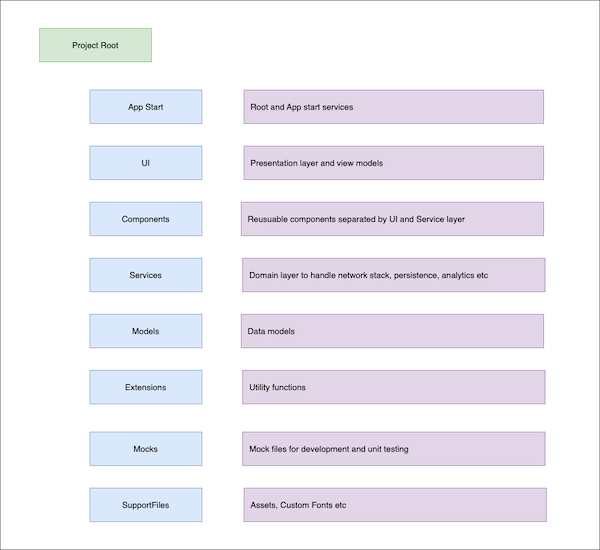

# Message Center App

Shows messages for a given user's email Id sorted by date in descending order

## Installation

- Install XCode 15.4.
- Clone this repo or download the source code from github.

```
$ git clone git@github.com:jmuthialu/MessageCenter.git
``` 

- Navigate to root folder, "MessageCenter".
- Double click "MessageCenter.xcodeproj" which will open the project in XCode.
- Swift package will automatically install SwiftLint dependency the first time the project is launched.
- If Swift package encounters any issues, clean the project, Cmd+Shift+K and resolve packages by navigating to File -> Packages -> Resolve Package Versions.
- Build the project, Cmd+B.
- If build is successful, run the project, Cmd+R.

### Min deployment version
iOS 16. For testing, make sure you have a device or simulator running on iOS 16 or later.
Tested on the following devices/Sim:
- iPhone 15 Plus running on iOS18 (beta).
- iPhone 11 running on iOS 17.4.
- (Simulator) iPhone 15 Pro Max running on iOS 17.5.
- (Simulator) iPhone 13 running on iOS 16.


## Features
- Email validation and error handling.
- Persists last entered email ID.
- Clear button in email Text Field.
- Handles network errors with retry.
- Shows error message if there is no network connection and disables "Get Messages" button.
- Pull to refresh in Messages screen.
- Integration of SwiftLint.
- Localization for US-English and Spanish-Mexico.
- Unit Tests for network call and email validation.
- Logger class that allows filtering of messages by module in  the console.

## Demo Video

https://github.com/jmuthialu/MessageCenter/assets/10758530/73b8d3d3-74e0-4d10-92e4-ab13f1f28dc6


## Folder Structure



## Architecture
- SOLID, CLEAN and MVVM with an eye to make the code readable, maintainable and scalabe.
- Prefers small but larger number of class files separated by single responsibility versus large but small number of class files.
- Swift UI for the win!

### Concurrency
- Employs Structued Concurrency to make the network calls in the background thread and @MainActor to show the results in main thread.

### Network stack
- Protocol driven `NetworkFactory` to create a real HTTP network service (`HTTPService`) or mock service (`MockHTTPService`) class.
- `URLBuilder` provides the ability to build URL requests based on path, queryParameters and request headers. 
- API layer has `BaseAPI` which can be subclassed to custom fit any APIs, say `MessagesAPI`. 
- API clases are responsbile to generate URL Request, abstract network calls and add any functionality such as search as needed by a specific module/API.
